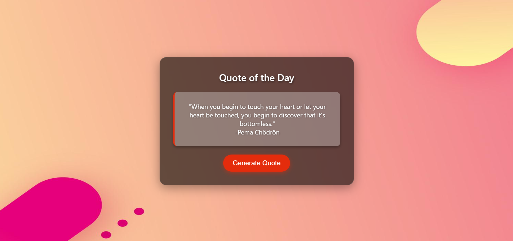

# Quote-Generator-5

A simple, lightweight Quote Generator built with HTML, CSS and JavaScript.

This small web app displays inspirational quotes and lets you generate a new random quote with a click. It's intentionally minimal so it's easy to understand, customize, and embed in other projects.

## Demo

> Note: The screenshot above is included in the repository. Open `index.html` in your browser to try the app locally.

## Features

- Random quote generation
- Clean, responsive UI (simple CSS)
- Single-file front-end (no build step required)

## Files

- `index.html` — main HTML file with embedded JavaScript
- `styles.css` — styling for the UI (if present)
- `script.js` — JavaScript logic (if present)
- `Screenshot 2024-08-12 164413.png` — screenshot used in this README

> If your files are named differently, update the filenames above to match.

## Installation / Run locally

1. Clone the repo:

   git clone https://github.com/BinaryVortex/Quote-Generator-5.git

2. Change into the project directory:

   cd Quote-Generator-5

3. Open the app in your browser:

   - Double-click `index.html`, or
   - Serve it with a simple static server (recommended for modern browser features):

     npx http-server .

## Usage

- Click the "New Quote" (or equivalent) button to generate a different quote.
- To add or change quotes, edit the array of quotes in the JavaScript file (`script.js` or inline in `index.html`).

## Customization

- Change the look and feel by editing `styles.css`.
- Add social sharing (Twitter/Facebook) by adding anchor tags that include the current quote text.
- Load quotes from a JSON file or external API for a larger set.

## Contributing

Contributions, issues and feature requests are welcome. Feel free to fork the repository and make a pull request.

## License

This project is open source — add a LICENSE file to declare the license (MIT is common).

---

Built by BinaryVortex
